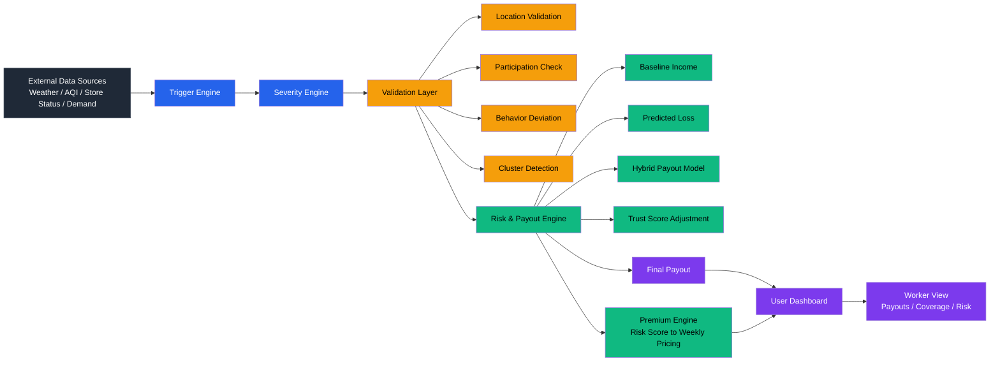

# Parametric Income Protection for Q-Commerce Workers

---

## Problem Statement

Q-commerce delivery workers face immediate income loss due to external disruptions such as heavy rainfall, poor air quality, dark store downtime, and demand fluctuations.

These disruptions are:
- **Frequent**
- **Unpredictable**
- **Beyond worker control**

Even when workers are active, their earning capacity drops significantly, with no existing mechanism to absorb these short-term income shocks.

---

## Gap in Existing Systems

- No **real-time income protection**
- Traditional insurance is **slow and claim-based**
- Workers bear **full financial impact**

---

## Core Challenge

Design a system that can:
- Detect disruptions automatically
- Quantify income loss in real time
- Trigger **instant, claim-free payouts**
- Operate on a **weekly pricing model**

---

## User Persona

### Q-Commerce Delivery Worker

- Operates within **fixed service zones (dark stores)**
- Earns via **task-based deliveries**
- Income depends on:
  - Order availability
  - Store uptime
  - Environmental conditions

### Income Characteristics

- **Daily, variable earnings**
- No guaranteed minimum income
- Highly sensitive to external disruptions

### Risk Exposure

- **Zone-level correlated risk**
- Loss independent of worker performance
- Affects multiple workers simultaneously

### Key Need

- Real-time income protection
- No manual claims
- Minimal effort from worker

---

## Solution Overview

A **parametric, AI-driven income protection system** that automatically compensates workers when external disruptions reduce earning potential.

### Core Pipeline

1. **Disruption Detection**
2. **Severity Estimation**
3. **Loss Prediction**
4. **Automated Payout Execution**

### Key Characteristics

- **Parametric** — Triggered by external data
- **Personalized** — Worker-specific pricing
- **Real-Time** — No delays or claims
- **Fraud-Resilient** — Multi-layer validation

---

## System Workflow

### Step 1: Disruption Trigger

Triggered when thresholds are exceeded:
- Rainfall
- AQI
- Store downtime
- Demand drop

---

### Step 2: Eligibility Validation

Worker must:
- Be in affected zone
- Be active during disruption
- Meet participation threshold

---

### Step 3: Loss Estimation

- Baseline income from history
- Severity determines impact
- Predicted loss computed

---

### Step 4: Hybrid Payout

Payout = min(Predicted Loss × Coverage, Baseline − Actual)

---

### Step 5: Trust Adjustment

Final Payout = Payout × Trust Score

Based on:
- Participation consistency
- Movement patterns
- Historical behavior

---

### Workflow Summary

Trigger → Validation → Loss Estimation → Payout → Trust Adjustment

---

## Parametric Triggers & Severity Model

### Heavy Rainfall

- ≥ 20 mm/hr

| Range | Severity |
|------|--------|
| 20–40 | 0.4 |
| 40–60 | 0.6 |
| >60 | 0.9 |

---

### AQI / Heat

- AQI ≥ 200 or Temp ≥ 38°C

| Range | Severity |
|------|--------|
| 200–300 | 0.3 |
| 300–400 | 0.6 |
| >400 | 0.9 |

---

### Store Downtime

Severity = Downtime / Work Time

---

### Trigger Priority

1. Store Downtime  
2. Weather  
3. Demand  

---

> **Note:** Thresholds are representative and dynamically calibrated in production using historical and environmental data.

---

## Premium & Risk Model

### Risk Score

Risk =
0.4 × Location +
0.2 × Temporal +
0.2 × Exposure +
0.2 × Store Reliability

---

### Expected Loss

Expected Loss = Baseline × Risk Score

---

### Premium

Premium = Expected Loss × (1 + Margin)

---

### Characteristics

- Personalized
- Weekly dynamic pricing
- Explainable (non black-box)

---

## Fraud Detection & Validation

Ensures payouts reflect **genuine external loss**, not user manipulation.

---

### 1. Location Validation

- Zone verification
- Movement consistency
- No teleporting/static spoof

---

### 2. Participation Check

- Active session
- Minimum engagement
- No prolonged idle

---

### 3. Behavior Deviation

Detects abnormal patterns:
- Sudden inactivity
- Inconsistent behavior vs history

---

### 4. Trust Score

Final Payout = Base × Trust Score

---

### 5. Cluster Detection

- Detects coordinated fraud
- Identifies abnormal spikes

---

### Key Properties

- Multi-signal validation
- Non-intrusive
- Scalable

---

## System Architecture

### Flow

Data → Trigger → Validation → Risk Engine → Output

### Components

- **Data**: Weather, AQI, Store, Worker signals  
- **Trigger Engine**: Detects disruptions  
- **Validation Layer**: Fraud filtering  
- **Risk Engine**: Pricing + payout  
- **Output**: Dashboard + notifications  

---

## Market Crash Handling

### Problem

Large-scale disruptions → mass payouts

---

### Controls

- **Trust-weighted payouts**
- **Dynamic coverage adjustment**
- **Payout caps**
- **Cluster monitoring**
- **Premium rebalancing**

---

### Goal

Balance:
- Fair payouts
- Fraud resistance
- Financial sustainability

---

## Conclusion

Unlike traditional parametric systems, our model validates not just the trigger, but the legitimacy of income loss through behavioral consistency.

The system continuously updates disruption probability and severity using historical patterns and recent trends, enabling adaptive risk estimation.

A real-time, parametric system that protects gig workers from income shocks using automated payouts, adaptive pricing, and robust fraud validation.

The system continuously updates disruption probability and severity using historical patterns and recent trends, enabling adaptive risk estimation.

The model ensures sustainability by aligning premiums with expected loss and dynamically adjusting to disruption patterns.

---

## Key Value

- Claim-free payouts  
- Personalized pricing  
- Fraud-resilient system  
- Scalable architecture  

---

## System Architecture Diagram

