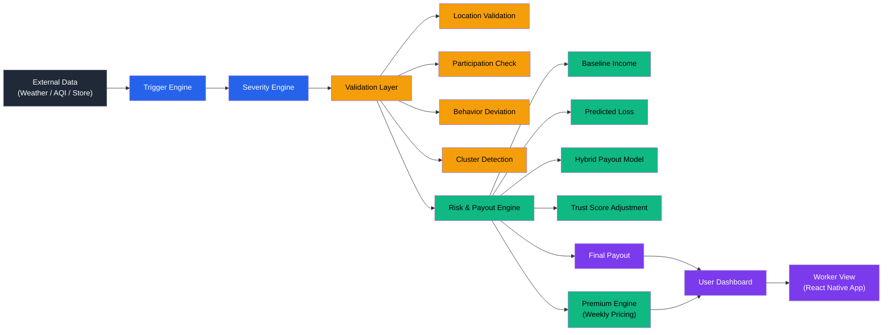

# 🛡️ Arovy: Parametric Income Protection

### *Claim-free, AI-driven financial safety net for quick-commerce delivery partners*

> A real-time insurance system that automatically compensates Q-commerce workers when external disruptions—like severe weather or dark store crashes—reduce their earning potential. We combine parametric triggers with continuous behavioral validation to ensure fair, instant, and fraud-resilient payouts.

<div align="center">

|🛒 Q-Commerce Focused|⚡ Same-Day Payouts|📱 App-Based Validation|🛡️ Fraud-Resilient|🔄 Weekly Pricing|
|:-:|:-:|:-:|:-:|:-:|

</div>

---

## 📋 Table of Contents

1. [The Problem & The Gap](#1-the-problem--the-gap)
2. [The Solution](#2-the-solution)
3. [User Persona Deep Dive](#3-user-persona-deep-dive)
4. [Application Workflow](#4-application-workflow)
5. [Example Scenario: Monsoon in Chennai](#5-example-scenario-monsoon-in-chennai)
6. [Parametric Triggers & Severity](#6-parametric-triggers--severity)
7. [Premium & Risk Model](#7-premium--risk-model)
8. [Fraud Defense Architecture](#8-fraud-defense-architecture)
9. [Market Crash Handling](#9-market-crash-handling)
10. [Tech Stack](#10-tech-stack)
11. [System Architecture](#11-system-architecture)
12. [Summary](#12-summary)

---

## 1\. The Problem & The Gap

Q-commerce delivery workers operate on tight margins around hyper-local fulfillment centers (dark stores). They face immediate income loss due to frequent, unpredictable disruptions completely beyond their control. 

**The Status Quo:**
* **No Real-Time Buffer:** Even when workers are actively logged in, their earning capacity drops to zero during a disruption.
* **Slow Legacy Systems:** Traditional insurance is claim-based, manually verified, and takes weeks to process.
* **Sole Burden:** Workers bear the full financial impact of systemic and environmental halts.

---

## 2\. The Solution

A **smart parametric system** that quantifies income loss in real time and triggers instant compensation. 

Instead of relying solely on broad weather APIs, our system uses a **lightweight mobile application** to securely validate worker presence, activity, and movement patterns in the background. This bridges the gap between *environmental data* and *actual human impact*.

### Core Pillars
* **Parametric:** Triggered automatically by objective external data (APIs).
* **Personalized:** Risk profiles and premiums are dynamically tailored per worker.
* **Fraud-Resilient:** Multi-signal validation logic confirms genuine loss.

---

## 3\. User Persona Deep Dive

**Target:** Q-Commerce Delivery Worker

| Attribute | Detail |
| :--- | :--- |
| **Operating Model** | Tied to fixed service zones (specific dark stores) |
| **Earnings Type** | Task-based, highly variable daily earnings |
| **Risk Exposure** | Zone-level correlated risk (one outage affects everyone in the zone) |
| **Key Vulnerability** | No guaranteed minimum wage; zero financial buffer for lost hours |
| **The Need** | Automated protection requiring **zero manual claims** or paperwork |

---

## 4\. Application Workflow

The pipeline runs silently in the background, executing compensation without human intervention.

` Trigger ➔ Validation ➔ Loss Estimation ➔ Payout ➔ Trust Adjustment `

<details>
<summary><b>🔍 Step-by-Step Breakdown</b></summary>

1. **Disruption Trigger:** System detects rainfall, AQI spikes, or store downtime via APIs.
2. **Eligibility Validation:** Verifies the worker is physically in the affected zone and actively online.
3. **Loss Estimation:** Compares real-time downtime against the worker's historical baseline income.
4. **Hybrid Payout Computation:** `Payout = min(Predicted Loss × Coverage, Baseline Income − Actual Income)`
5. **Trust Adjustment:** Applies a multiplier based on the worker's historical behavior and movement consistency (`Final = Payout × Trust Score`).
</details>

---

## 5\. Example Scenario: Monsoon in Chennai

To understand how the workflow operates in the real world, let's look at a typical day for **Karthik**, a Q-commerce delivery partner assigned to a dark store in **T. Nagar, Chennai**. 

* **The Setup:** Karthik's baseline income is ₹800/day. He pays a personalized weekly premium of ₹45 based on T. Nagar's risk score. 
* **The Event (2:00 PM):** A sudden, severe Northeast Monsoon downpour hits Chennai. The dark store suspends operations for 3 hours due to waterlogging.

**Here is how Arovy protects Karthik:**

1. 📡 **Trigger:** The weather API (`Tomorrow.io`) registers 50mm/hr of rainfall in the T. Nagar pin code. The severity engine flags this as a `0.6` magnitude disruption.
2. 📱 **Validation:** The Node.js backend pings Karthik's React Native app. It verifies he is actively logged in, his GPS coordinates show he is sheltering near the dark store, and he hasn't exhibited erratic "teleporting" behavior. 
3. 📉 **Loss Estimation:** The system calculates that Karthik missed 3 hours of peak delivery time, predicting a direct income loss of ₹300 for that window.
4. 💸 **Payout & Trust Adjustment:** Karthik has a clean history, giving him a Trust Score of `1.0`. The system approves the full coverage amount.
5. ✅ **Resolution (5:00 PM):** Karthik receives a push notification: *"T. Nagar weather disruption verified. ₹300 has been credited to your UPI."* 

**Result:** Karthik didn't file a single claim, take photos, or call a helpline. He stayed safe from the rain, and his daily earnings were protected.

---

## 6\. Parametric Triggers & Severity

Disruption severity determines the payout scale. *Note: Thresholds dynamically calibrate in production based on city-specific historical data.*

| Event Type | Critical Threshold | Severity Scale |
| :--- | :--- | :--- |
| **🌧️ Heavy Rainfall** | $\ge$ 20 mm/hr | `0.4` (20-40mm) ➔ `0.6` (40-60mm) ➔ `0.9` (>60mm) |
| **🌫️ Extreme AQI** | $\ge$ 200 | `0.3` (200-300) ➔ `0.6` (300-400) ➔ `0.9` (>400) |
| **🌡️ Extreme Heat** | $\ge$ 38°C | Categorized similar to AQI severity |
| **🚧 Social Disruption** | Verified Strike / Curfew | `0.5` (Localized Bandh) ➔ `0.8` (Zone-wide) ➔ `1.0` (City-wide Curfew) |
| **🏪 Store Downtime** | Server/Power failure | `Severity = Downtime / Scheduled Work Time` |


**Priority Hierarchy:** Store Downtime > Weather Events > Demand Fluctuations

---

## 7\. Premium & Risk Model

Pricing is dynamic, weekly, and entirely transparent (non black-box).

### The Math
1. **Risk Score** = `(0.4 × Location Risk) + (0.2 × Temporal Risk) + (0.2 × Exposure Risk) + (0.2 × Store Reliability)`
2. **Expected Loss** = `Baseline Income × Risk Score`
3. **Weekly Premium** = `Expected Loss × (1 + Margin)` *(Margin ensures system liquidity)*

> **Why Weekly?** Matches the payout and expense cycle of the typical gig worker.

---

## 8\. Fraud Defense Architecture

To ensure payouts reflect **genuine external loss** and not user manipulation, the system employs multi-signal, non-intrusive validation.

* 📍 **Location Validation:** Prevents GPS spoofing; checks movement consistency against known dark-store delivery routes.
* ⏱️ **Participation Check:** Verifies active session lengths and flags prolonged, unnatural idle periods.
* 📉 **Behavior Deviation:** Detects sudden drops in activity that contradict a worker's historical baseline.
* 🕸️ **Cluster Detection:** Identifies abnormal spikes in simultaneous claims to dismantle coordinated fraud rings.
* ⚖️ **Trust Score Scaling:** `Final Payout = Base Payout × Trust Score`. Bad actors are proportionally penalized without halting the entire system.

---

## 9\. Market Crash Handling & System Liquidity

> **The Existential Threat:** In parametric insurance, a highly correlated event—such as a Category 4 cyclone, city-wide floods, or massive political strikes—triggers simultaneous payouts across thousands of workers. Without robust algorithmic circuit breakers, a single "Black Swan" event will instantly drain the platform's liquidity pool and cause total system insolvency. 

To ensure the system survives catastrophic disruptions while continuing to protect genuine workers, Q-Kavach deploys an aggressive, multi-layered **Market Crash Protocol**. 

### 🛡️ Layer 1: Zero-Trust Eligibility (The Frontline Defense)
When a city-wide disruption is declared, the system assumes high risk for opportunistic fraud and elevates validation parameters.
* 📍 **Cryptographic Zone Validation:** It is not enough to simply have the app open. The worker's device must prove physical presence within the dark store's operational geofence *before* the disruption peaked. 
* 🚴 **Kinematic Intent Verification:** The system analyzes background telemetry (accelerometer drift, GPS ping density) to verify a valid delivery movement pattern. This instantly filters out bad actors attempting to "teleport" into a red zone from their living rooms just to claim the payout.

### ⚙️ Layer 2: Financial Circuit Breakers (The Survival Levers)
To prevent the rapid depletion of the capital pool during a massive concurrent trigger, algorithmic financial controls automatically deploy.
* 📉 **Dynamic Coverage Contraction (Solidarity Scaling):** If platform-wide disruption crosses a critical threshold (e.g., 70% of all city dark stores go offline), the system activates fractional coverage. Instead of paying out at 100% of the predicted loss, coverage dynamically scales down (e.g., to 80%). This enforces "shared survival"—ensuring every affected worker receives meaningful aid without bankrupting the system.
* 🛑 **Trust-Gated Payout Ceilings:** Absolute algorithmic caps are placed on daily payouts to prevent extreme financial bleeding. During a market crash event, this cap is tightly bound to the worker's historical **Trust Score**. High-trust veterans receive maximum allowable protection, while new or low-trust accounts are heavily throttled.

### 🕸️ Layer 3: Anti-Syndicate Cluster Monitoring
During systemic chaos, coordinated fraud rings attempt to overwhelm the system.
* 🚨 **Surge Lockdown:** If a specific dark store zone registers a statistically impossible spike in active workers (e.g., a 500% increase in eligibility checks within 3 minutes), the system flags a "Cluster Anomaly."
* 🔒 **Deep Behavioral Quarantine:** Payouts for that specific cluster are temporarily escrowed. The validation engine switches to deep-scan mode, cross-referencing IP geolocations, device fingerprints, and pre-disruption earnings velocity to surgically sever the bad actors from the genuine workers.

### 📈 Layer 4: Algorithmic Recovery 
* 🔄 **Post-Event Premium Rebalancing:** A massive payout event drastically alters the city's empirical risk profile. The pricing engine automatically recalibrates. Subsequent weekly premiums for the affected zones are subtly mathematically adjusted to reflect the updated environmental reality, slowly amortizing the financial shock and restoring platform liquidity over the following weeks.


---

## 10\. Tech Stack

| Layer | Technology | Purpose |
| :--- | :--- | :--- |
| **📱 User Application** | `React Native` / `Expo` | Worker-facing mobile app; handles background GPS and session validation. |
| **💻 Admin Dashboard** | `React.js` / `TailwindCSS` | Web app for platform admins to view live disruption maps and system health. |
| **⚙️ Backend API** | `Node.js` / `Express` | Core server handling webhooks, validation routing, and user state. |
| **🧠 ML & Scripts** | `Python` / `scikit-learn` | Risk scoring, fraud detection models, and data processing cron jobs. |
| **🗄️ Database** | `PostgreSQL` / `Supabase` | Persistent storage for worker profiles, historical baselines, and policies. |
| **⚡ Cache & Locks** | `Redis` | Real-time geofencing, API rate limiting, and payout deduplication. |
| **🌐 External Data** | `Tomorrow.io` / `AQICN` | Sourcing live weather, precipitation, and air quality metrics. |

---

## 11\. System Architecture



---

## 12\. Summary

```text
┌─────────────────────────────────────────────────────────────────┐
│           PARAMETRIC INCOME PROTECTION FOR Q-COMMERCE           │
│         Claim-Free Financial Safety Net for Delivery Workers    │
└─────────────────────────────────────────────────────────────────┘

  WHO      →  Q-commerce delivery workers tied to dark stores.

  WHAT     →  Automatic income protection against rain, AQI, and 
               store downtime. No manual claims.

  HOW      →  React Native app validates background data.
               Trigger → Validation → Loss Estimation → Payout.

  PRICE    →  Weekly dynamic pricing based on a personalized
               Risk Score (Location + Time + Exposure + Store).

  PAYOUT   →  Hybrid model adjusted by a Trust Score multiplier.

  FRAUD    →  Movement validation · Cluster detection 
               Behavior deviation checks · Trust scoring.

  STABILITY→  Zone-level eligibility · Dynamic coverage scaling
               Payout caps during market crash events.

┌─────────────────────────────────────────────────────────────────┐
│  When a dark store goes offline or severe rain hits,            │
│  the system verifies the worker's presence and activity,        │
│  calculates the predicted loss, and automatically triggers      │
│  a trust-adjusted payout.                                       │  
└─────────────────────────────────────────────────────────────────┘
```
